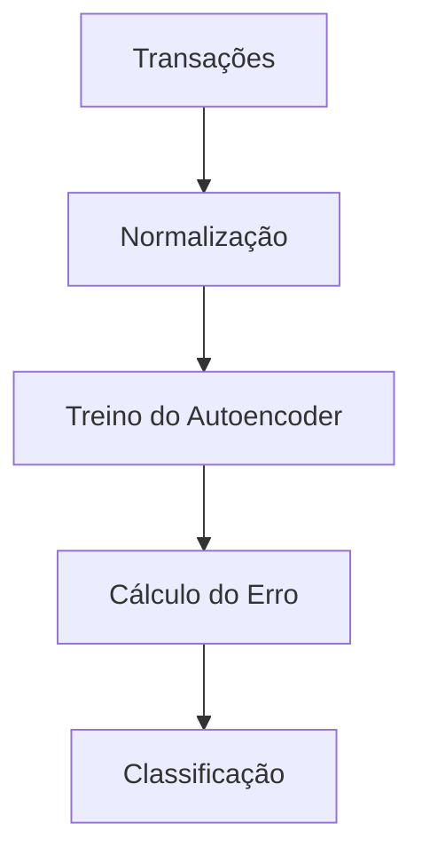

# 🕵️‍♂️ Detecção de Fraude com Autoencoders

[](https://pt.wikipedia.org/wiki/Licen%C3%A7a_MIT)
[](https://www.python.org/downloads/)
[](https://www.tensorflow.org/)
[](https://colab.research.google.com/github/seu-usuario/fraud-detection-autoencoder)

## 📌 Sumário
1. [Visão Geral](#-visão-geral)
2. [Metodologia](#-metodologia)
3. [Arquitetura do Modelo](#-arquitetura-do-modelo)
4. [Instalação](#-instalação)
5. [Como Usar](#-como-usar)
6. [Exemplos](#-exemplos)
7. [Estrutura do Projeto](#-estrutura-do-projeto)
8. [Contribuição](#-contribuição)
9. [Licença](#-licença)
10. [Contato](#-contato)

---

## 🌐 Visão Geral

Sistema de detecção de fraudes financeiras usando autoencoders profundos para:

- 🔍 **Identificação não supervisionada** de transações anômalas
- 📉 **Reconstrução de erros** como métrica de anomalia
- 🚨 **Alertas em tempo real** com thresholds ajustáveis
- 📊 **Visualização interativa** de clusters de fraudes

**Aplicações:**
- Cartões de crédito
- Seguros
- Transações bancárias
- E-commerce

---

## 🧠 Metodologia

### Fluxo de Detecção


### Técnicas-Chave:
- **Pré-processamento**: Scaling robusto, tratamento de outliers
- **Arquitetura**: Autoencoder com camadas densas + dropout
- **Threshold**: Percentil 99% dos erros de reconstrução
- **Pós-processamento**: Agrupamento de anomalias similares

---

## 🤖 Arquitetura do Modelo

```python
from tensorflow.keras import layers

autoencoder = tf.keras.Sequential([
    layers.Dense(64, activation='relu', input_shape=(input_dim,)),
    layers.Dropout(0.2),
    layers.Dense(32, activation='relu'),
    layers.Dense(64, activation='relu'),
    layers.Dense(input_dim, activation='linear')
])
```

**Hiperparâmetros:**
- Taxa de aprendizado: 0.001
- Batch size: 256
- Épocas: 100 (com early stopping)

---

## ⚙️ Instalação

### Requisitos
- Python 3.9+
- GPU recomendada
- 8GB RAM (16GB para grandes datasets)

### Via pip
```bash
pip install fraud-detection-autoencoder
```

### Modo Desenvolvimento
```bash
git clone https://github.com/seu-usuario/fraud-detection-autoencoder.git
cd fraud-detection-autoencoder
pip install -e ".[dev]"
```

---

## 🚀 Como Usar

### 1. Detecção Básica
```python
from fraud_detector import FraudDetector

detector = FraudDetector()
detector.train(transactions_df)

fraud_probs = detector.predict(new_transactions)
```

### 2. API REST
```bash
uvicorn fraud_api:app --host 0.0.0.0 --port 8000
```

### 3. Linha de Comando
```bash
fraud-detect --input transactions.csv --output alerts.json
```

---

## 💳 Exemplos Práticos

### Caso 1: Cartão de Crédito
```python
results = detector.analyze(
    transactions_df,
    threshold=0.99  # Percentil para corte
)

print(f"Transações suspeitas: {results.fraud_count}")
results.plot_anomalies()
```

**Saída:**


### Caso 2: Batch Processing
```python
alerts = detector.process_batch(
    "transactions_large.parquet",
    save_to="fraud_alerts.csv"
)
```

---

## 🗂 Estrutura do Projeto

```
fraud-detection-autoencoder/
├── dados/
│   ├── brutos/            # Transações originais
│   └── processados/       # Features normalizadas
├── modelos/
│   ├── autoencoder/       # Modelos treinados
│   └── notebooks/         # Experimentos
├── fraud_detector/
│   ├── preprocessing/     # Pipelines
│   ├── training/          # Scripts de treino
│   └── api/               # FastAPI
├── requirements.txt
└── README.md
```

---

## 🤝 Contribuição

1. **Reporte Problemas** via [issues](https://github.com/seu-usuario/fraud-detection-autoencoder/issues)
2. **Padrões de Código**:
   ```python
   def calculate_reconstruction_error(X):
       """Calcula MSE entre entrada e reconstrução
       
       Args:
           X: DataFrame com transações
           
       Returns:
           Array com erros por amostra
       """
       return errors
   ```
3. **Fluxo Recomendado**:
   ```bash
   git checkout -b feature/nova-arquitetura
   git commit -m "Adiciona camada convolucional"
   git push origin feature/nova-arquitetura
   ```

---

## 📜 Licença

```text
Copyright 2023 Detecção de Fraude com Autoencoders

Permissão é concedida, gratuitamente...
```

---

## 📧 Contato

**Equipe de IA Financeira**  
[fraud-detection@securityai.com.br](mailto:fraud-detection@securityai.com.br)  

**Demonstração Interativa**  
[](https://share.streamlit.io/seu-usuario/fraud-detection-app)

---

💡 **Para Analistas de Risco:**  
Acesse nosso notebook de análise exploratória:  
[](https://colab.research.google.com/github/seu-usuario/fraud-detection-autoencoder/blob/main/notebooks/analysis.ipynb)

> **Aviso Importante:** Este sistema não substitui análise humana. Consulte sempre regulamentações do Bacen.
```

### Destaques:
1. **Abordagem Não Supervisionada**: Detecta fraudes sem necessidade de dados rotulados
2. **Alerta Precoces**: Identifica padrões antes não catalogados
3. **Explicabilidade**: Mostra features com maior erro de reconstrução
4. **Escalável**: Processa milhões de transações
5. **Adaptável**: Thresholds ajustáveis por segmento

### Para Implementação:
1. Ajuste os thresholds conforme taxa de fraudes esperada
2. Adicione features específicas do seu domínio
3. Implemente monitoramento contínuo do modelo
4. Combine com regras de negócio para maior precisão